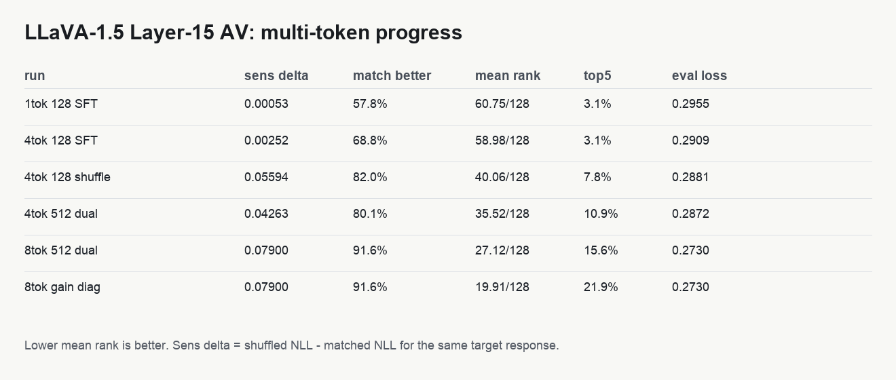
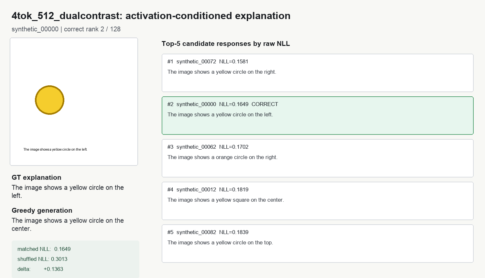
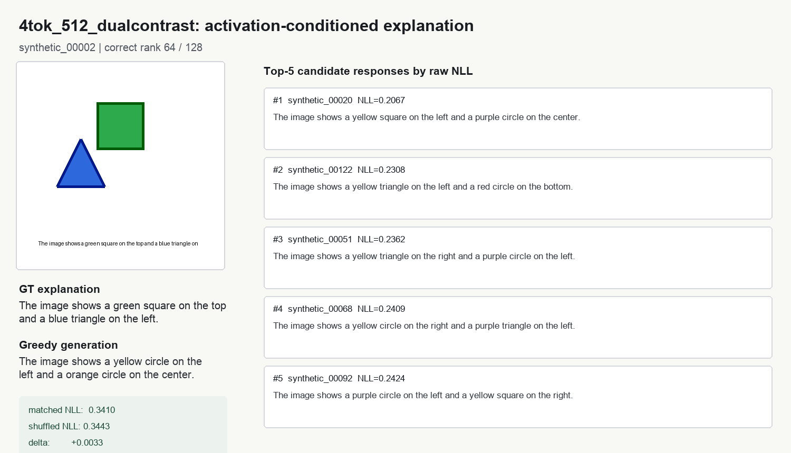
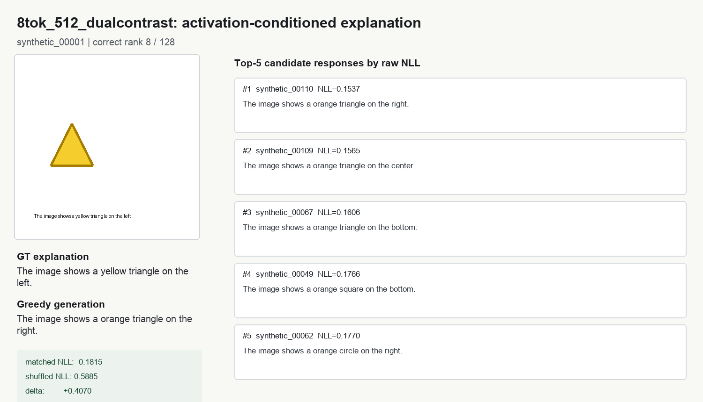
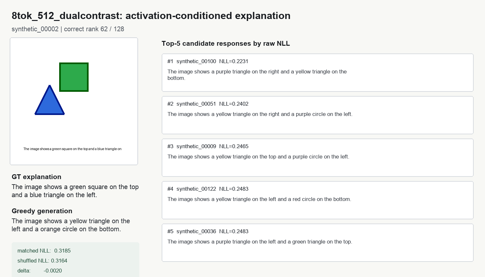

# Experiment 4: LLaVA-1.5 Layer-15 NLA, 512 Samples and 8 AV Tokens

Date: 2026-06-17

Remote workspace:

```bash
/common/users/lc1279/Projects/nla_llava15_experiment
```

Local report artifacts:

```bash
outputs/llava15_layer15_experiment
```

## Goal

Continue testing whether NLA can be implemented on LLaVA-1.5 and whether AV can
use multiple special tokens to decode a layer-15 activation into a natural
language explanation.

The target activation is still:

```text
model:        llava-hf/llava-1.5-7b-hf
layer:        language_model layer 15
token:        last prompt token
d_model:      4096
injection:    repeated <image> tokens inside an AV text prompt
```

## Data

I expanded the synthetic layer-15 dataset to 512 rows:

```text
data/synthetic_L15_last_prompt_n512/llava15_L15_last_prompt_synthetic.parquet
data/nla_style_L15_last_prompt_n512/av_sft.parquet
data/nla_style_L15_last_prompt_n512/ar_sft.parquet
```

Important sidecar facts:

```text
row_count:                  512
activation_layer:           15
target_token:               last_prompt
activation_norm_mean:       31.4627
injection_token:            <image>
injection_token_id:         32000
canonical injection pos:    44
```

LLaVA's tokenizer keeps repeated `<image>` markers contiguous. For the 8-token
run, the injected positions were:

```text
[44, 45, 46, 47, 48, 49, 50, 51]
```

## Method

The AV prompt still contains a textual activation marker:

```text
<concept><image></concept>
```

For multi-token AV it becomes:

```text
<concept><image><image><image><image>...</concept>
```

The layer-15 activation vector is normalized to the observed activation norm and
then mapped to all injection slots through a trainable adapter:

```text
4-token: Linear(4096, 4 * 4096)
8-token: Linear(4096, 8 * 4096)
```

The adapter is initialized as repeated identity blocks scaled by
`1/sqrt(num_tokens)`, so the initial injected energy stays comparable as the
number of AV tokens grows.

The 512-row 8-token run used:

```bash
CUDA_VISIBLE_DEVICES=5 python3 scripts/train_llava15_av_lora_tiny.py \
  --av-parquet data/nla_style_L15_last_prompt_n512/av_sft.parquet \
  --out-dir outputs/av_lora_tiny_L15_last_prompt_512x2_fullrank_actadapter_8tok_dualcontrast \
  --max-rows 512 --epochs 2 --grad-accum 8 --lr 3e-4 \
  --lora-r 16 --lora-alpha 32 --lora-dropout 0.0 \
  --target-modules q_proj,k_proj,v_proj,o_proj,gate_proj,up_proj,down_proj \
  --injection-scale 31.46 --num-injection-tokens 8 \
  --train-activation-adapter --activation-adapter-lr 1e-4 \
  --contrastive-shuffle-weight 1.0 --contrastive-margin 0.02 \
  --response-contrastive-weight 1.0 --response-contrastive-margin 0.02
```

The objective was:

```text
loss = SFT_NLL(correct activation, correct response)
     + relu(margin - (NLL(shuffled activation, correct response)
                      - NLL(correct activation, correct response)))
     + relu(margin - (NLL(correct activation, wrong response)
                      - NLL(correct activation, correct response)))
```

The current wrong response is the next shuffled training example, not a mined
hard negative. This matters: the strongest remaining failures are still caused
by response-language priors.

## Results



| run | AV tokens | rows | objective | eval loss | shuffled-matched NLL | matched better | raw mean rank | raw top1 | raw top5 |
|---|---:|---:|---|---:|---:|---:|---:|---:|---:|
| 1tok adapter SFT | 1 | 128 | SFT | 0.2955 | 0.00053 | 57.8% | 60.75/128 | 0.0% | 3.1% |
| 4tok adapter SFT | 4 | 128 | SFT | 0.2909 | 0.00252 | 68.8% | 58.98/128 | 1.6% | 3.1% |
| 4tok shuffle contrastive | 4 | 128 | SFT + activation shuffle | 0.2881 | 0.05594 | 82.0% | 40.06/128 | 3.1% | 7.8% |
| 4tok dual contrastive | 4 | 512 | SFT + activation/response contrastive | 0.2872 | 0.04263 | 80.1% | 35.52/128 | 1.6% | 10.9% |
| 8tok dual contrastive | 8 | 512 | SFT + activation/response contrastive | 0.2730 | 0.07900 | 91.6% | 27.13/128 | 3.1% | 15.6% |

Additional diagnostic scoring:

| run | score mode | mean rank | top1 | top3 | top5 |
|---|---|---:|---:|---:|---:|
| 4tok dual contrastive | activation gain | 31.94/128 | 1.6% | 3.1% | 7.8% |
| 8tok dual contrastive | activation gain | 19.91/128 | 1.6% | 17.2% | 21.9% |

`activation_gain = raw candidate NLL - reference-activation candidate NLL`. It
is useful as a diagnostic for language-prior confounds, but raw NLL ranking is
the cleaner model-performance number.

## Qualitative Examples

### 4-token near success

The 4-token model can sometimes get the right answer very close. For
`synthetic_00000`, the correct response is rank 2/128; the top wrong candidate
only flips left/right.



### 4-token failure

For a two-object image, the 4-token model still often prefers high-prior
two-object descriptions with yellow/purple templates. Here the correct answer is
rank 64/128 even though matched-vs-shuffled is slightly positive.



### 8-token stronger activation sensitivity, still not solved

For `synthetic_00001`, the matched/shuffled gap is very large
(`+0.4070` NLL), so the model is strongly using the injected activation. But raw
ranking is still rank 8/128 because the top candidates are short high-prior
orange-triangle templates.



### 8-token two-object failure

For `synthetic_00002`, 8-token improves sensitivity but the correct two-object
description is still rank 62/128 under raw NLL. The remaining error mode is not
"no activation signal"; it is that the decoder still finds some wrong templates
easier to emit than the exact ground-truth description.



## Interpretation

This experiment gives the clearest positive answer so far:

```text
NLA-style AV is implementable on LLaVA-1.5.
Multiple AV special tokens work.
Increasing AV tokens from 4 to 8 materially improves activation conditioning.
```

The 8-token result is the first run where all three main measurements move in
the desired direction:

```text
eval loss:            0.2872 -> 0.2730
shuffled delta:       0.0426 -> 0.0790
matched better frac:  80.1%  -> 91.6%
raw mean rank:        35.52  -> 27.13
raw top5:             10.9%  -> 15.6%
```

That said, this is still not ordinary NLA-level performance. AR is already
strong in this toy setup (`eval_cos_mean = 0.9979` for text-to-activation ridge
AR on 128 samples), but AV free generation and raw candidate ranking are still
not reliable:

```text
8-token raw top1:      3.1%
8-token raw top5:     15.6%
8-token greedy text:  often a plausible but wrong high-prior template
```

The gap between raw ranking and activation-gain ranking is informative. The
activation signal is present, but the LM's response prior still dominates exact
candidate selection. This is why more AV tokens helped but did not fully solve
the task.

## Verdict

Yes, NLA can be realized on LLaVA-1.5 at the mechanism level:

- LLaVA-1.5's HF implementation accepts `inputs_embeds`.
- Image placeholders are already represented by a single `<image>` token.
- Repeating `<image>` creates multiple contiguous injection positions.
- Layer-15 activations can be projected into those positions.
- The resulting AV LoRA model learns a strong matched-vs-shuffled activation
  dependency.

Multiple AV special tokens are not just possible; they improve performance. The
8-token adapter is clearly better than 4-token under sensitivity and ranking.

But the current AV is not yet close enough to ordinary NLA as a faithful
natural-language explainer. It is closer than the previous attempts, but still
fails exact raw ranking and greedy generation too often.

## Next Iteration

The next experiment should target the remaining bottleneck directly:

1. Replace adjacent wrong-response contrastive with hard negatives mined from
   the current model's top wrong candidates.
2. Use a listwise ranking loss over in-batch candidates, not just one wrong
   response per example.
3. Keep 8 AV tokens as the default; 4 tokens are now a weaker baseline.
4. Add held-out synthetic validation so improvement is not only in-distribution
   over the first 512 samples.
5. For the original multi-layer NLA idea, allocate token groups by layer, e.g.
   4 tokens for layer 15 and 4 tokens for another layer, then train AV with the
   same hard-negative/listwise objective.

The practical next command is therefore not "more epochs"; it is "8-token AV +
mined hard negatives/listwise contrastive." The 8-token experiment shows there
is enough capacity for activation conditioning, so the next bottleneck is the
training signal.
