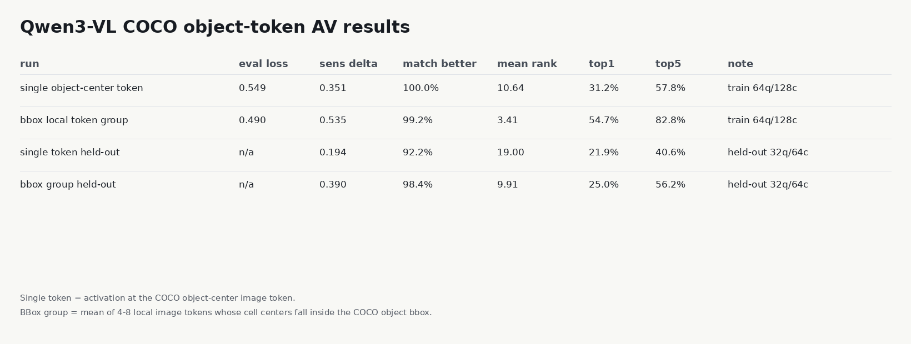
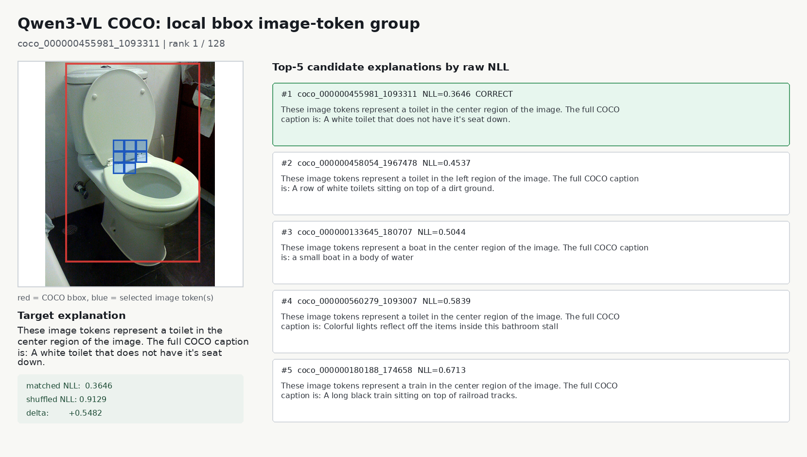
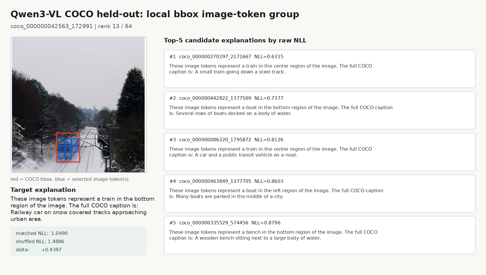

# Qwen3-VL COCO Object-Token NLA 实验报告

日期：2026-06-18

这轮实验专门回答你的两个新问题：

1. 换真实图片，例如 MSCOCO，Qwen3-VL 的 NLA/AV 是否还能解释 activation？
2. 不用全图 `image_mean`，只解释某一个 image token，或者某个 object bbox 内的多个 image tokens，效果如何？

结论：**可以做，而且局部多个 image tokens 明显比单个 image token 更稳定。** 单 token 确实包含对象/位置语义，但噪声更大；bbox 内 4-8 个局部 image tokens 聚合后，解释性能明显提高。这说明 Qwen3-VL 的 image-token 表征更像“局部区域语义分布在一小片 token group 里”，而不是每个 token 都独立、干净地对应一个 object。

## 1. 实验设置

数据来自 MSCOCO val2017：

- train-like split：seed 2027，128 张 COCO 图片
- held-out split：seed 3031，64 张不同 COCO 图片
- 每张图选一个 prominent COCO object annotation
- 用 COCO bbox 把 object 映射到 Qwen3-VL 的 image-token grid

Qwen3-VL 的 image-token 数量随图像尺寸变化，不再是 synthetic 里的固定 100：

```text
num_image_tokens: 144 到 400
token grid examples: 12x16, 20x15, 20x20, ...
```

比较两个 activation target：

| target | 含义 |
|---|---|
| `object_center` | COCO bbox 中心对应的一个 image token |
| `object_bbox_mean` | COCO bbox 内 4-8 个局部 image tokens 的平均 |

注意：这里没有用全图 `image_mean`。

可视化里红框是 COCO bbox，蓝格是被解释的 Qwen image token(s)：





## 2. 长标签实验：object + region + COCO caption

第一版标签是：

```text
These image tokens represent a toilet in the center region of the image.
The full COCO caption is: A white toilet that does not have it's seat down.
```

这个目标比较严格，因为它要求局部 token 不只解释 object，还要恢复全图 caption。

| run | split | eval loss | sensitivity delta | matched better | mean rank | top1 | top5 |
|---|---|---:|---:|---:|---:|---:|---:|
| single object-center token | train 64q/128c | 0.549 | +0.351 | 100.0% | 10.64 | 31.2% | 57.8% |
| bbox local token group | train 64q/128c | 0.490 | +0.535 | 99.2% | 3.41 | 54.7% | 82.8% |
| single object-center token | held-out 32q/64c | n/a | +0.194 | 92.2% | 19.00 | 21.9% | 40.6% |
| bbox local token group | held-out 32q/64c | n/a | +0.390 | 98.4% | 9.91 | 25.0% | 56.2% |

长标签结论：

- 两种 token target 都有正的 matched-vs-shuffled sensitivity，说明 activation 真的在控制解释。
- bbox token group 明显强于单 token。
- held-out 上仍然有信号，但不像 synthetic 那样接近完美。
- 失败常常不是完全离谱，而是把局部 object 搞成语义相近或上下文相近的候选。

一个 held-out 困难例子：



这里目标是 bottom-region train。模型 top candidates 也大多是 train/transport/scene 相近描述，但正确样本排第 13/64。说明它抓到部分语义，但精确到 COCO caption 级别还不稳。

## 3. 短标签实验：只解释 object + region

为了更贴近“这个 token 被理解成什么”，我又跑了一版短标签，不要求复原 COCO caption：

```text
These image tokens represent a toilet in the center region of the image.
```

结果：

| run | split | eval loss | sensitivity delta | matched better | mean rank | top1 | top5 |
|---|---|---:|---:|---:|---:|---:|---:|
| single object-center token | train 64q/128c | 0.112 | +0.278 | 96.9% | 6.28 | 28.1% | 68.8% |
| bbox local token group | train 64q/128c | 0.041 | +0.547 | 99.2% | 2.95 | 53.1% | 87.5% |
| single object-center token | held-out 32q/64c | n/a | +0.156 | 90.6% | 11.31 | 25.0% | 53.1% |
| bbox local token group | held-out 32q/64c | n/a | +0.412 | 98.4% | 5.19 | 34.4% | 65.6% |

短标签结论：

- 短标签训练更容易，bbox group eval loss 降到 0.041。
- bbox group held-out sensitivity +0.412，matched better 98.4%，说明局部多 token 确实有可解释信号。
- ranking top1/top5 不能直接当“语义准确率”，因为短标签有重复。train 128 行只有 90 个 unique labels，最大重复 11 次；held-out 64 行只有 52 个 unique labels，最大重复 6 次。例如多个样本都是 `person/center`，候选 response 完全相同，按 sample id 排名会惩罚语义等价候选。
- 下一步应该做 unique-label ranking 或 semantic match accuracy，而不是只按样本 ID 排名。

## 4. 对单个 token 的看法

单个 object-center image token 不是没信息。它在 held-out 上也有正 sensitivity：

```text
long label held-out delta:  +0.194
short label held-out delta: +0.156
```

但是单 token 的解释更脆：

- 容易把同类 object 的位置搞混，比如 `person/center` vs `person/left`
- 容易受 COCO caption 高频模式影响
- 对小物体、遮挡、或者 bbox 不精确时更不稳定

这说明如果我们想解释“特定一个 image token”，可以做，但应该把目标定义成局部、短的语义标签，而不是整句 caption。

## 5. 对多个 image token 的看法

局部 bbox token group 是目前更可靠的路径。它不是全图 `image_mean`，而是只平均 object bbox 内 4-8 个 image tokens。

它比单 token 强很多：

```text
long held-out top5:  single 40.6% -> bbox group 56.2%
short held-out top5: single 53.1% -> bbox group 65.6%
long held-out delta: single +0.194 -> bbox group +0.390
short held-out delta: single +0.156 -> bbox group +0.412
```

直觉解释：一个 object 在 Qwen3-VL 里通常不是压在一个 image token 上，而是分布在一片空间 token 上。解释这片 token group，比解释单个 token 更符合模型内部表示。

## 6. 当前限制

这轮是真实 COCO 图片，但仍然是小样本：

- train 128，held-out 64
- object 选择用了 prominent COCO bbox
- 短标签有重复 candidate，导致 sample-id ranking 低估语义匹配
- 长标签要求局部 token 复原全图 caption，可能过难

所以现在能说：

```text
Qwen3-VL 的特定 image token / 局部 image-token group activation 可以被 AV 解释；
局部多 token 比单 token 稳定；
真实图上也有 matched-vs-shuffled 的可靠信号。
```

还不能说：

```text
任意单个 image token 都能可靠复原完整自然语言 caption。
```

## 7. 下一步建议

最值得继续的是三件事：

1. **unique-label ranking**：把重复的 `person/right` 合并，评估语义标签是否正确，而不是样本 ID 是否正确。
2. **多层 local tokens**：同一 COCO bbox，抽 L10/L15/L20 的 object token group，让 AV 同时解释多层 activation。
3. **AR 反向重构**：解释文本反向 reconstruct object-center / bbox-token activations，形成更接近原 NLA 的 AV+AR 闭环。

我倾向下一步先做 `unique-label ranking + semantic accuracy`，因为这会更公平地回答“这个 token 被模型理解成什么对象/位置”。

## 8. 主要产物

本地：

- `outputs/qwen3vl_experiment/scripts/extract_qwen3vl_coco_object_tokens.py`
- `outputs/qwen3vl_experiment/scripts/make_qwen3vl_coco_short_label_parquet.py`
- `outputs/qwen3vl_experiment/scripts/make_qwen3vl_coco_token_visuals.py`
- `outputs/qwen3vl_experiment/coco_token_visuals/`
- `outputs/qwen3vl_experiment/coco_remote_outputs/`
- `outputs/qwen3vl_experiment/coco_short_outputs/`

远端：

- `/common/users/lc1279/Projects/nla_llava15_experiment/data/qwen3vl_coco_L15_object_center_n128_seed2027/`
- `/common/users/lc1279/Projects/nla_llava15_experiment/data/qwen3vl_coco_L15_object_bbox_mean_n128_seed2027/`
- `assets/figures/qwen3vl_coco/`
