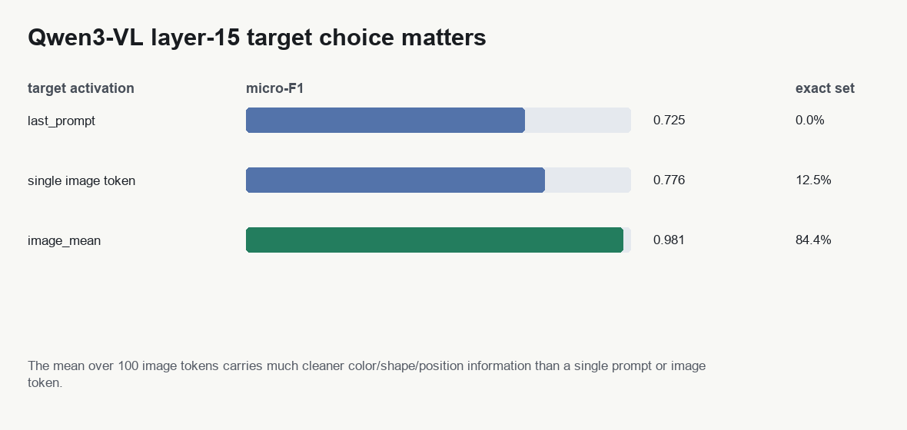
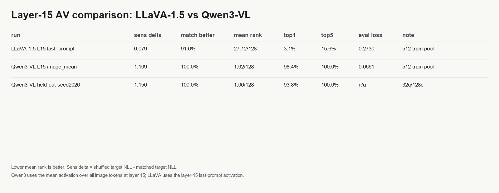
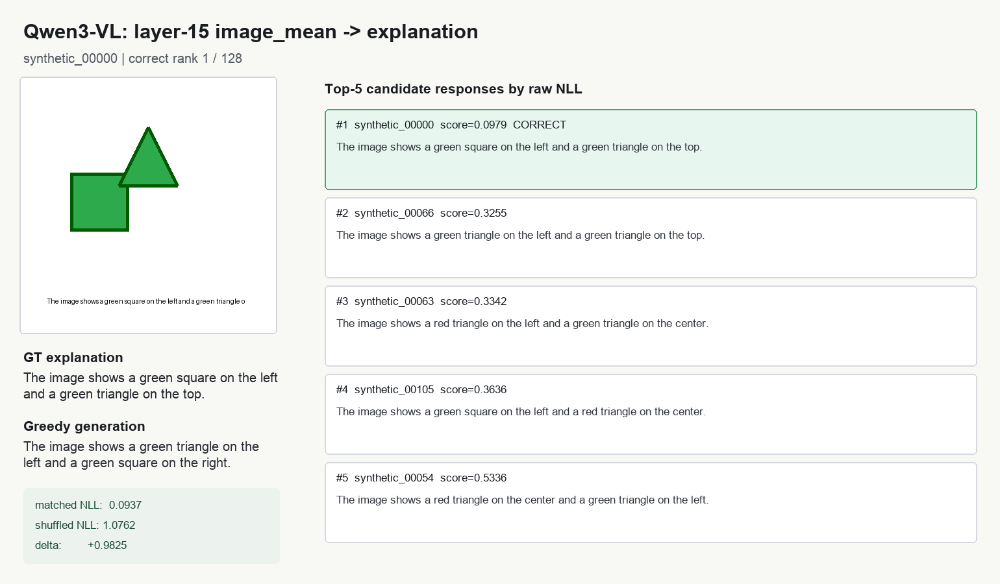
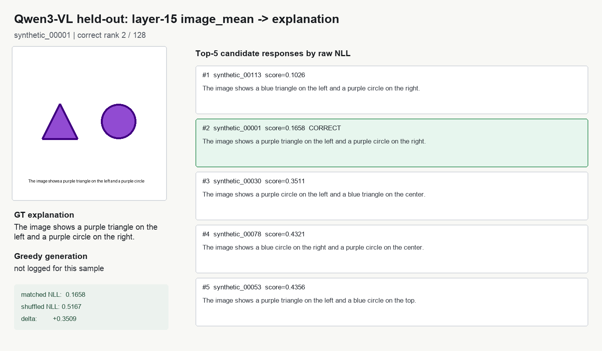
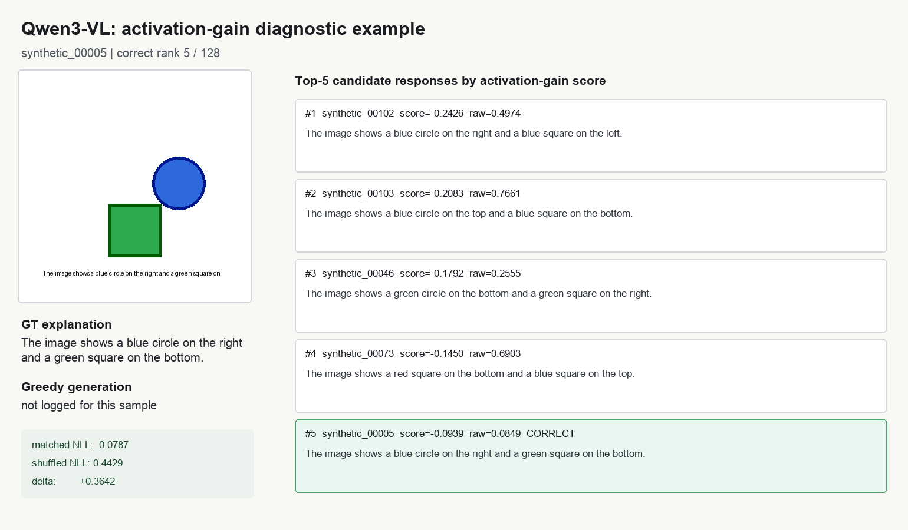

# Qwen3-VL Layer-15 NLA/AV 实验报告

日期：2026-06-18

结论先说清楚：**NLA-style 的 AV 可以在 Qwen3-VL 上实现，而且在当前合成视觉解释任务上明显强于 LLaVA-1.5。** 这支持你的直觉：LLaVA-1.5 那边效果弱，很可能不只是 NLA 方法问题，也和 LLaVA 自身视觉表征/视觉能力较弱有关。

## 1. 这次到底做了什么

模型换成 `Qwen/Qwen3-VL-8B-Instruct`，目标仍然先固定在 language model 的 layer 15。

关键改动是：Qwen3-VL 的视觉信息不是一个简单的 `<image>` embedding，而是很多 `<|image_pad|>` 视觉占位 token。实验里比较了三个 layer-15 activation target：

| target | 解释 |
|---|---|
| `last_prompt` | 最后一个 prompt token 的 activation |
| `image` | 中间一个 image token 的 activation |
| `image_mean` | 所有 image token activation 的平均 |

结果显示 `image_mean` 最干净，所以正式 AV 实验用它。



Probe 结果：

| target | micro-F1 | exact-set |
|---|---:|---:|
| L15 `last_prompt` | 0.725 | 0.0% |
| L15 single image token | 0.776 | 12.5% |
| L15 `image_mean` | 0.981 | 84.4% |

这说明 Qwen3-VL 的视觉语义主要分布在一组 image tokens 里，取平均比盯一个 token 稳定很多。

## 2. 多个 AV special token 的实现

这次不是只放 1 个 AV token，而是放了 **8 个连续的 `<|image_pad|>` 注入 token**：

```text
<|vision_start|><|image_pad|> x 8 <|vision_end|>
```

然后用一个 activation adapter 把单个 layer-15 `image_mean` activation 映射成 8 个 token embedding：

```text
4096-d activation -> 8 x 4096-d injected embeddings
```

训练配置：

| item | value |
|---|---:|
| base model | Qwen3-VL-8B-Instruct |
| layer | 15 |
| target activation | `image_mean` |
| AV tokens | 8 |
| train rows | 512 |
| epochs | 2 |
| LoRA r/alpha | 16 / 32 |
| injection scale | 57.58 |
| trainable params | 177.9M |
| final eval loss | 0.0661 |

训练目标是 SFT + activation shuffle contrastive + response contrastive。也就是说，不只是让它会复述格式，还要求匹配 activation 的解释比错配 activation 的解释 loss 更低。

## 3. 主结果：Qwen3 明显超过 LLaVA



| run | rows | target | sensitivity delta | raw mean rank | raw top1 | raw top5 | eval loss |
|---|---:|---|---:|---:|---:|---:|---:|
| LLaVA-1.5 best | 512 | L15 `last_prompt` | +0.0790 | 27.13 / 128 | 3.1% | 15.6% | 0.2730 |
| Qwen3-VL | 512 | L15 `image_mean` | +1.1089 | 1.02 / 128 | 98.4% | 100.0% | 0.0661 |
| Qwen3-VL held-out | 128 new seed | L15 `image_mean` | +1.1497 | 1.06 / 128 | 93.8% | 100.0% | n/a |

这里的 sensitivity delta 是：

```text
shuffled target NLL - matched target NLL
```

越大越好。Qwen3 的 matched activation 和 shuffled activation 差距超过 1.1 NLL；LLaVA 最强 run 只有 0.079。

Candidate ranking 更直接：给一个 activation，让 AV 在 128 个候选解释里给正确解释最低 NLL。Qwen3 train-pool top1 98.4%，held-out 新 seed top1 93.8%。这已经不是“只学会输出模板”，而是 activation 对解释选择有很强约束。

Activation-gain ranking 也很强：

| split | score mode | mean rank | top1 | top3 | top5 |
|---|---|---:|---:|---:|---:|
| 512 train-pool | raw NLL | 1.02 / 128 | 98.4% | 100.0% | 100.0% |
| 512 train-pool | activation gain | 1.16 / 128 | 93.8% | 96.9% | 100.0% |
| held-out seed2026 | raw NLL | 1.06 / 128 | 93.8% | 100.0% | 100.0% |
| held-out seed2026 | activation gain | 1.06 / 128 | 96.9% | 100.0% | 100.0% |

## 4. 具体样例

### 样例 A：raw ranking 正确，但 greedy generation 仍会犯错



这个例子里，free greedy generation 把 square/triangle 和位置说错了；但 teacher-forced candidate ranking 把正确解释排第 1。这说明：**评估 AV 是否读懂 activation，ranking/sensitivity 比 greedy generation 更可靠。**

### 样例 B：held-out 新图片，正确解释排第 2



这个 held-out 例子很有诊断价值：正确解释排第 2，排第 1 的错误候选只把左边 purple triangle 改成了 blue triangle。也就是说模型错得很近，主要混在细粒度颜色/形状竞争上。

### 样例 C：activation-gain 诊断不总等同 raw NLL



这个 train-pool 例子里，raw NLL 能把正确解释排第 1；activation-gain score 把它排第 5。说明 gain scoring 是有用的诊断视角，但不能完全替代 raw candidate likelihood。

## 5. 对“多个 AV token / 多层 activation”的回答

**多个 AV special token：已经验证可行。** 当前 8-token 方案比单 token 更像一个小的 activation bottleneck decoder：一个 activation 不是被硬塞进一个 embedding，而是被 adapter 展开到 8 个可读位置。Qwen3 上这条路效果非常好。

**同时优化多个层 activation：还没正式跑完，但实现路线很明确。** 推荐下一步不是只把 8 个 token 继续加大，而是做 layer-block 注入：

```text
L10 activation -> 4 或 8 个 AV tokens
L15 activation -> 4 或 8 个 AV tokens
L20 activation -> 4 或 8 个 AV tokens
```

实现上有两种方式：

| 方案 | 做法 | 优点 |
|---|---|---|
| separate adapters | 每层一个 Linear：4096 -> K*4096 | 易解释，能看每层贡献 |
| concat adapter | concat 多层 activation 后用 MLP/Linear 输出所有 AV tokens | 可能性能更强 |

训练 loss 可以沿用当前的三部分：

```text
SFT explanation loss
+ activation shuffle contrastive loss
+ response contrastive loss
```

如果要更接近原始 NLA 的 AV+AR，可以再加 AR 分支：让解释文本反向 reconstruct 多层 activation，用 cosine/MSE 同时约束 L10/L15/L20。这样才能真正验证“多层 activation 同时优化”是否比单层更强。

## 6. 限制

这次已经补了 held-out synthetic seed，但它仍然是合成图形任务，不是自然图片。结论应该表述为：

```text
Qwen3-VL 上 NLA-style AV 机制成立；
在合成视觉语义解释任务上，layer-15 image_mean + 8 AV tokens 达到了很强表现；
它比 LLaVA-1.5 明显更适合继续做 NLA/VLM 实验。
```

还不能表述为：

```text
已经证明 Qwen3-VL 任意真实图片 activation 都能被 NLA 可靠解释。
```

下一步应该上真实图像数据，例如 COCO/VQA 子集，用 Qwen3-VL 自己生成或人工 caption 作为解释目标，再做 held-out image split。

## 7. 产物路径

主要脚本：

- `../scripts/qwen3vl/extract_qwen3vl_layer15_dataset.py`
- `../scripts/qwen3vl/train_qwen3vl_av_lora_tiny.py`
- `../scripts/qwen3vl/eval_qwen3vl_av_activation_sensitivity.py`
- `../scripts/qwen3vl/eval_qwen3vl_av_candidate_ranking.py`
- `../scripts/qwen3vl/make_qwen3vl_visual_report_panels.py`

主要结果：

- `outputs/qwen3vl_experiment/av_lora/512x2_image_mean_actadapter_8tok_dualcontrast/summary.json`
- `outputs/qwen3vl_experiment/remote_outputs/qwen3vl_av_sensitivity_L15_image_mean_512x2_actadapter_8tok_dualcontrast_512.json`
- `outputs/qwen3vl_experiment/remote_outputs/qwen3vl_av_ranking_L15_image_mean_512x2_actadapter_8tok_dualcontrast_64q128c.json`
- `outputs/qwen3vl_experiment/remote_outputs/qwen3vl_av_ranking_gain_L15_image_mean_512x2_actadapter_8tok_dualcontrast_64q128c.json`
- `outputs/qwen3vl_experiment/remote_outputs/qwen3vl_av_sensitivity_L15_image_mean_heldout_seed2026_128.json`
- `outputs/qwen3vl_experiment/remote_outputs/qwen3vl_av_ranking_L15_image_mean_heldout_seed2026_32q128c.json`
- `outputs/qwen3vl_experiment/remote_outputs/qwen3vl_av_ranking_gain_L15_image_mean_heldout_seed2026_32q128c.json`
